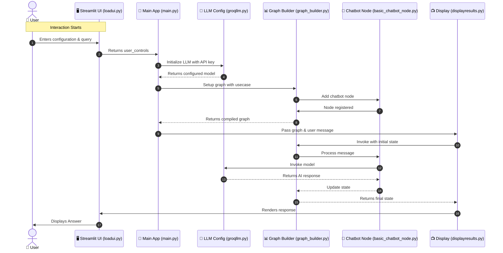

# LangGraph Agentic AI Chatbot 🤖

An intelligent, stateful chatbot built with LangGraph, LangChain, and Streamlit. This application demonstrates how to build agentic AI workflows using state graphs with multiple LLM provider support.

## 🌟 Features

- **Multiple LLM Support**: Integration with Groq, OpenAI, and Anthropic
- **Stateful Conversations**: Maintains conversation context using LangGraph's state management
- **Interactive UI**: Clean Streamlit interface for real-time chat interactions
- **Modular Architecture**: Well-organized codebase with separation of concerns
- **Extensible Design**: Easy to add new use cases and agent workflows

## 🔄 Execution Flow

Here is how the Agent processes a user request:



## 📁 Project Structure

```
Agenticchatbot/
├── app.py                          # Application entry point
├── requirements.txt                # Python dependencies
├── src/
│   └── langgraphagenticai/
│       ├── main.py                 # Main application logic
│       ├── State/
│       │   └── state.py            # State management (TypedDict)
│       ├── LLMs/
│       │   └── groqllm.py          # Groq LLM configuration
│       ├── graph/
│       │   └── graph_builder.py    # Graph construction & compilation
│       ├── Nodes/
│       │   └── basic_chatbot_node.py  # Chatbot processing node
│       └── UI/
│           ├── uiconfigfile.py     # UI configuration
│           └── streamlitui/
│               ├── loadui.py       # UI loader & controls
│               └── displayresults.py  # Result rendering
```

## 🚀 Getting Started

### Prerequisites

- Python 3.8+
- Groq API Key (or OpenAI/Anthropic if configured)

### Installation

1. Clone the repository:
```bash
git clone https://github.com/reasow2011/Agenticchatbot.git
cd Agenticchatbot
```

2. Install dependencies:
```bash
pip install -r requirements.txt
```

3. Run the application:
```bash
streamlit run app.py
```

### Usage

1. Open the Streamlit UI in your browser
2. In the sidebar:
   - Select your LLM provider (Groq/OpenAI/Anthropic)
   - Choose a model
   - Enter your API key
   - Select a use case (Chatbot/Stateful Graph/Agentic Workflow)
3. Type your message in the chat input
4. The AI agent processes your request and displays the response

## 🛠️ Technologies Used

- **LangGraph**: State graph orchestration
- **LangChain**: LLM integration framework
- **Streamlit**: Web UI framework
- **Groq/OpenAI/Anthropic**: LLM providers

## 📝 License

This project is open source and available under the MIT License.

## 🤝 Contributing

Contributions, issues, and feature requests are welcome!