# End to End Agentic AI Chatbots

## Overview

An end-to-end agentic AI chatbot system built with LangGraph, supporting multiple LLM providers and featuring a modular architecture for flexible agent orchestration.

## 🏗️ Architecture

The application follows a modular, layered architecture with clear separation of concerns:

```mermaid
graph TB
    User[👤 User] -->|Interacts| UI[Streamlit UI Layer]
    
    subgraph "UI Layer"
        UI --> LoadUI[Load UI Controls]
        UI --> DisplayResults[Display Results]
        LoadUI -->|User Settings| UserInput[User Input Handler]
    end
    
    subgraph "LLM Configuration Layer"
        UserInput -->|Configure| LLMConfig[LLM Configurator]
        LLMConfig --> Groq[Groq LLM]
        LLMConfig --> OpenAI[OpenAI]
        LLMConfig --> Gemini[Google Gemini]
        LLMConfig --> VertexAI[Vertex AI]
        LLMConfig -->|Selected Model| SelectedLLM[Selected LLM Model]
    end
    
    subgraph "Orchestration Layer"
        SelectedLLM -->|Initialize| GraphBuilder[Graph Builder]
        GraphBuilder -->|Setup| LangGraph[LangGraph State Machine]
        
        LangGraph --> Nodes[Agent Nodes]
        Nodes --> State[State Management]
        State -->|Update| Nodes
    end
    
    subgraph "Execution Layer"
        Nodes --> Tools[External Tools]
        Tools -->|Results| Nodes
        Nodes -->|Process| Response[Generate Response]
    end
    
    Response -->|Return| DisplayResults
    DisplayResults -->|Show| User
    
    style User fill:#e1f5ff
    style UI fill:#fff4e1
    style LangGraph fill:#e8f5e9
    style SelectedLLM fill:#f3e5f5
    style Response fill:#fff9c4
```

### Key Components:

1. **UI Layer** (`src/langgraphagenticai/UI/`)
   - Streamlit-based web interface
   - User input handling and settings management
   - Results visualization and display

2. **LLM Configuration Layer** (`src/langgraphagenticai/LLMs/`)
   - Multi-provider LLM support
   - Dynamic model selection and configuration
   - Supports OpenAI, Groq, Google Gemini, and Vertex AI

3. **Orchestration Layer** (`src/langgraphagenticai/graph/`)
   - LangGraph-based state machine
   - Graph builder for use-case specific workflows
   - Agent node orchestration

4. **State Management** (`src/langgraphagenticai/State/`)
   - Conversation state tracking
   - Context preservation across interactions
   - State transitions and updates

5. **Agent Nodes** (`src/langgraphagenticai/Nodes/`)
   - Individual processing units
   - Task-specific logic execution
   - Tool integration and response generation

6. **Tools Integration** (`src/langgraphagenticai/tools/`)
   - External API integration
   - Utility functions and helpers
   - Extended capabilities for agents

## Features

Coming soon...