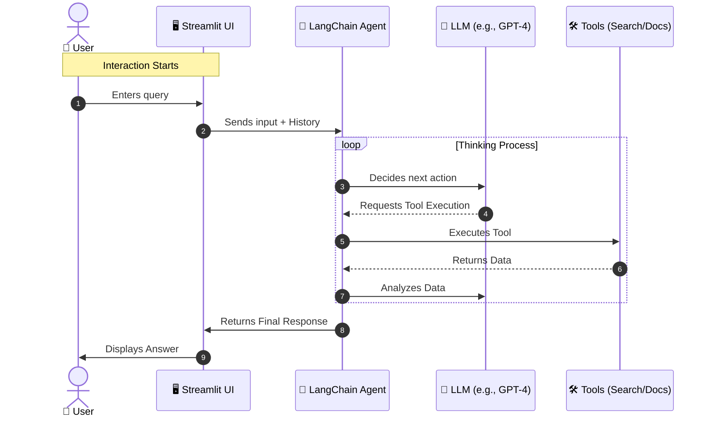

## 🔄 Execution Flow

Here is how the Agent processes a user request:

```mermaid
sequenceDiagram
    autonumber
    actor User as 👤 User
    participant UI as 🖥️ Streamlit UI
    participant Agent as 🤖 LangChain Agent
    participant LLM as 🧠 LLM (e.g., GPT-4)
    participant Tools as 🛠️ Tools (Search/Docs)

    Note over User, UI: Interaction Starts
    User->>UI: Enters query
    UI->>Agent: Sends input + History

    loop Thinking Process
        Agent->>LLM: Decides next action
        LLM-->>Agent: Requests Tool Execution
        Agent->>Tools: Executes Tool
        Tools-->>Agent: Returns Data
        Agent->>LLM: Analyzes Data
    end

    Agent->>UI: Returns Final Response
    UI->>User: Displays Answer
```
